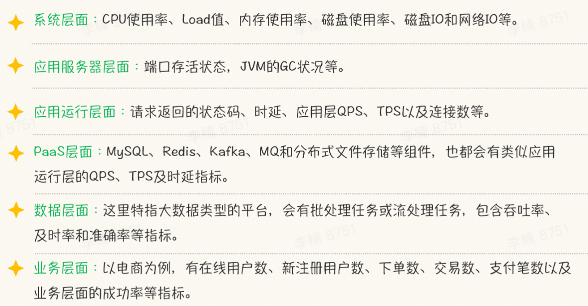
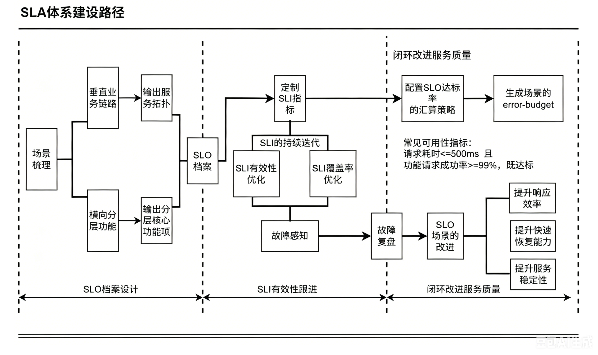
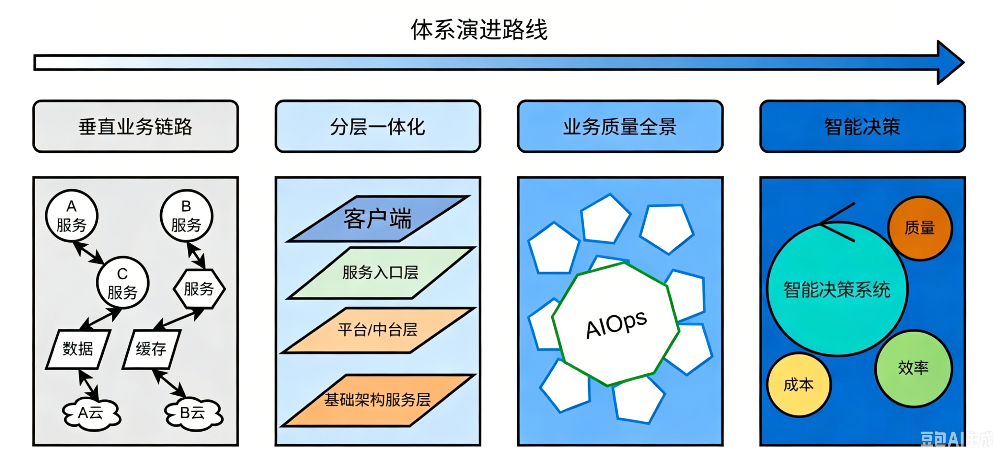
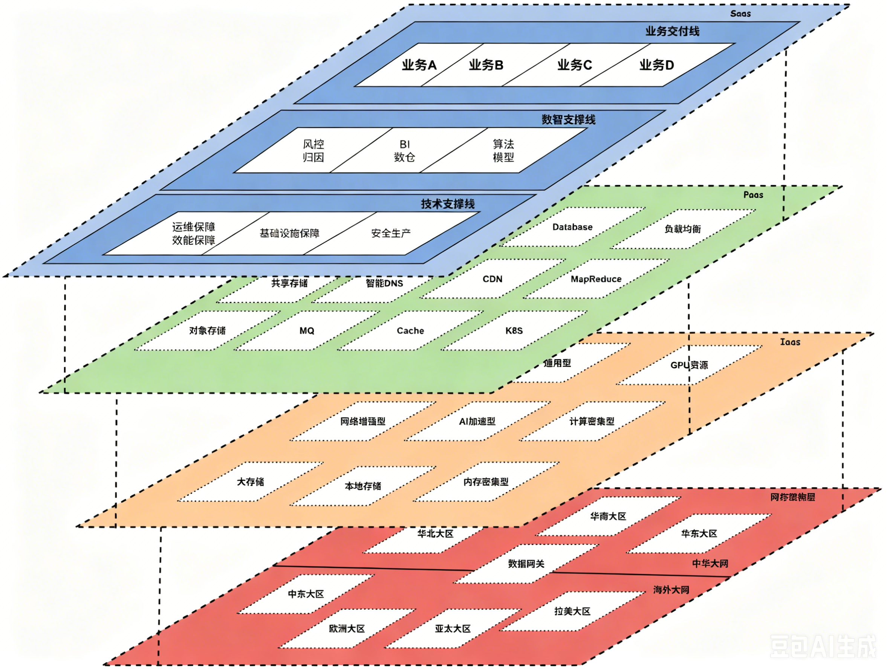
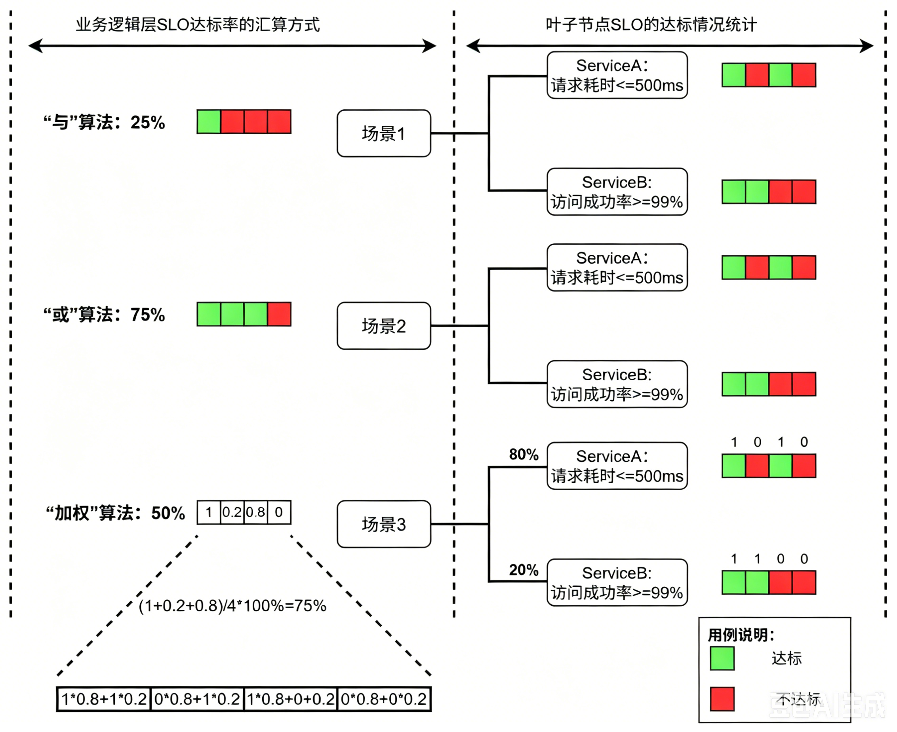
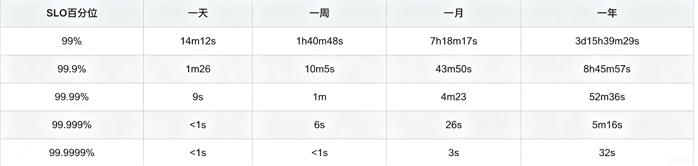
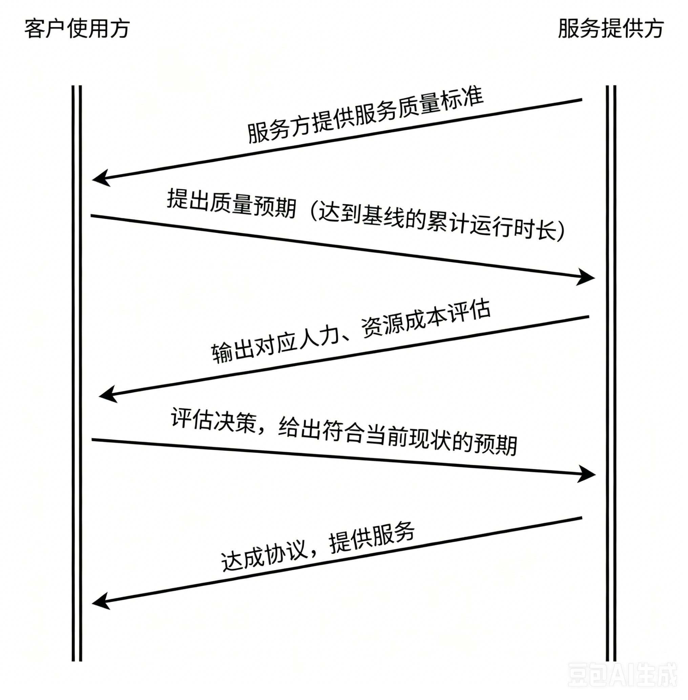

# 业务SLA质量体系建设

## 背景简介

通过合理准确的SLI、SLO的制定，业务流中相互依赖的指标梳理，使服务质量可被度量，签署相互认可的服务承诺协议SLA。通过双方对服务质量的认可和约束，驱动服务不断提升稳定性。

## SLA质量体系建设目标

**1、度量服务可用性：Availability = Successful request / Total request**

**2、通过数字驱动，提升终端用户体验**

## **收益**

1. **可预期的服务质量** ：各级业务服务功能指标化，通过对指标的度量和承诺，实现对业务提供可预期的服务。

2. **资源精准投放** ：对于不同的服务质量要求，可以有差别的进行建设投入，可以更精准的把控资源。

3. **更快更准的故障响应** ：从上层业务指标层层渗透到底层资源指标&技术指标，形成以应用为最小单元的维护单位，每个应用相互之间建立依赖关系拓扑，全方位监控业务每个运行环节的状态，使故障时更快更精准的定位，直达故障点。可以通过上层SLO的业务告警对告警信息进行收敛。

4. **数字驱动的用户体验提升** ：通过可视化，数字化的描述用户体验情况，直观的保障用户体验。通过对“故障预算”的合理使用，做到有规划、有预期的控制线上变更带来的影响。

## SLI/SLO/SLA体系介绍

### 概念

- **SLI(Service Level Indicator，服务等级指标)** 指定了服务所提供功能的一种期望状态。其实就是我们选择哪些指标来衡量我们的稳定性。

- **SLO(Service Level Objective，服务等级目标)** 指的就是我们设定的稳定性目标，比如“几个 9”这样的目标。

- **SLA(Service Level Agreement，服务等级协议)** 是一个涉及2方的合约，双方必须都要同意并遵守这个合约。当需要对外提供服务时，SLA是非常重要的一个服务质量指标，需要产品和研发部门的同时介入。

### SLI常见指标按层分类

### SLI指标选择原则

1. 被衡量稳定性的直接主体

2. 直接体现在用户体验方面的指标

### SLO常见应用场景

**SLO是用SLI来描述的，** 比如以下SLO：

- 每分钟平均qps > 100k/s

- 接入层99% 用户访问延迟 < 500ms

- 99% 每分钟带宽 > 200MB/s

### SLO组合类型

- **单一指标计算** 
    - **公式** ：Availability = Successful request / Total request （（状态码非 5xx占比） & （时延 <= 80ms占比））
    
    - **适用场景** ：比较简单的接口，只用一个指标就可以确认可用性。
    
    比如：一个简单的api接口，只用固定测试用例的url返回状态码就可以确认服务可用性，那么就可以单独对这个状态码计算成功率。

- **多指标组合** （and/or）
    - **公式** ：Availability = SLO1 & SLO2 & SLO3
    
    - **适用场景** ：一个指标不能完全确保服务可用性的场景，可以考虑使用多个指标来衡量，
        比如：官网的可用性需要从三个维度确保，并且是 and的关系：
        
        - SLO1：99.95% 状态码成功率
        
        - SLO2：90% Latency <= 50ms
        
        - SLO3：99% Latency <= 100ms

- **多指标加权组合** 
    - **公式** ：Availability = service1.SLO1 * weight1 + service2.SLO2 * weight2 + service3.SLO3 * weight3 +...
    
    - **适用场景** ：一个上层应用指标，需要多个不同权重的指标联合起来支撑上层应用的可用性。
    
    比如：推荐服务的准确率，既包含推荐算法模型的准确性，也包含用户画像的准确性。这之间的权重比例需要业务自行认定。

### 如何快速确定SLI

> 可以参考google的SLI设定模型： [VALET](https://landing.google.com/sre/workbook/chapters/slo-document)

**Volume- 容量** ，是指服务承诺的最大容量是多少。比如某个业务集群的qps、会话连接数。数据集群的吞吐量。

**Availablity- 可用性** ，是指服务是否可以整体提供服务，比如，分布式大数据集群的可用率，即使后端node挂掉几个，只要服务还可以正常使用， 业务依然是可用状态

**Latency- 时延** ，度量服务响应请求的时效性。比如p95访问延迟<60ms.

**Errors- 错误率** ，服务状态码中定义的错误比率，可以是标准的http  status code，也可以是用户自定义的status code

**Tickets- 人工介入** ，可以针对一些二级服务部门的作业平台，自动化平台进行衡量，比如大数据平台的脚本出错后不能自动修复，需要人工干预。运维部门的Devops流水线，中间组件的兼容性不够，总是人工干预到流水线内部。

### 指标等级划分

服务指标按照关注的层级，和对质量要求的程度分为以下几个等级：

| **指标等级** | **指标描述** | **指标说明** |
| --- | --- | --- |
| **一级指标** | 可用率 | 最基本的指标，只关注到服务本身的可用性，不考虑服务本身之外的依赖关系 |
| **二级指标** | 成功率 | 比可用率高级，在服务本身可用的前提下，度量请求送达服务端被成功处理的比率 |
| **三级指标** | 请求耗时 | 比成功率高级，在送达率较高的基础上，增加对服务及时性，处理效率的度量 |
| **四级指标** | 数据准确率  | 比请求耗时高级，在服务效率提升到一定程度后，增加内容感知方面的度量，进一步提升服务质量 |
| **五级指标** | 业务逻辑层可用率 | 比数据准确率更高级，要求通过技术手段可以感知到业务逻辑设计上的问题 |
| 待补充 |  |  |

### 举例

1. **服务可用性**

以基础网络可用性为例，来讲解服务可用性：

黄金指标：网络质量通过三个指标可以衡量：丢包率、延迟、端口可用率

SLI：对于这三个指标，运维侧基于当前的硬件资源环境，可以提供的目标为：

SLI1:端口可用率>99.95%

SLI2:延迟<100ms

SLI3:丢包率<0.05%

SLO：服务可用率目标：99%(Availability) =SLI1 and SLI2 and SLI3

SLA: 单位时间内，一定的业务功能范围内，服务可用性的达成率

比如：网络可用性自然年内达到99.95%，既：全年内网络质量达到端口可用率>99.95%，延迟小于100ms，且丢包率<0.05%的总时间占全年时间的99.95%。

2. **指标等级**

以nginx负载均衡器的指标类型为例，来讲解指标等级定义：

服务可用率：5XX状态码代表负载均衡的本身路由功能不可用。所以可用率就是非5XX状态码的可用时长占比。

服务成功率：4XX状态码代表负载均衡已经将请求转发到了后端，但是后端服务异常。所以成功率就是非4xx的状态的时长占比。

请求耗时：指客户端发起一次request开始计算，到客户端接收到response的完整链路耗时。

数据准确性（命中率）：指请求返回的结果数据，与需求的内容一致。所以准确率就是一致性的次数占总次数的比率。

## 体系设计

### SLA体系设计

#### **第一阶段：档案设计** 

- 垂直业务链路：主要针对面向用户端的服务功能，需要从最顶层用户体验侧，下钻到最末尾的最小发布单元。

- 横向分层功能：主要针对横向平台类功能大类，比如统一接入层、统一数分平台等，需要提供平台核心功能的关键指标。

#### 第二阶段：SLI有效性跟进

- 定制SLI指标：根据SLO档案，配置SLI指标，接入一线告警群。

- SLI持续迭代：通过告警群持续治理，提升有效性和覆盖率。

- 故障感知：具体在每次故障管理过程中，持续关注SLI的改进和迭代。

#### 第三阶段：感知线上问题，闭环推动服务质量提升

- 提升服务性能：响应耗时反应的是 实际服务的处理效率，往这方面整改属于提升效率类。

- 提升服务稳定性：成功率的指标，反应了服务的稳定性状态，往这方面整改，属于提升稳定性。

- 缩短恢复耗时：SLA主要承诺的还是可用性的累计时长，因此从缩短每次故障后快速恢复的能力也是一种保障SLA达到预期的有效手段。

### SLO观测体系演进路线

垂直业务链路：

分层一体化：

业务质量全景：

智能决策：

### SLO体系结构图

#### 层级说明：业务架构组成按层级划分

1. SaaS层：业务平面，所有业务线提供的核心服务功能。
    该平面又分为三级部门：
    
    1. 一级-前台业务部门，有独立APP，用户请求的直接入口。
    
    2. 二级-后台支撑部门，通过给业务部门提供支撑，或者被业务APP调用的支撑类平台/中台部门
    
    3. 基础架构部门，这里主要指流水线最末端的基础部门。

2. PaaS层：服务平面，公有云侧给业务提供的主要服务功能支撑。

3. IaaS层： 基础资源平面，支撑上层服务&业务功能的物理基础资源。

4. 网络架构层：整体网络&数据中心的架构拓扑层。

#### 对象说明

**主客体是相对的**

1. 业务部门，为外界客户提供服务，同时也是支撑部门的客户。

2. 支撑部门，为业务部门提供功能支撑，也是基础部门的客户。

3. 基础部门，既为业务部门提供服务，也为支撑部门提供服务。

#### 建设说明

SLA 指标应聚焦在第一个平面里开展，展开步骤

1、每个业务线先找到自己的核心客户，确认客户对业务本身最关心的可用性指标。

2、基于客户提到的服务指标，转化到自己业务系统中的具体可被采集的数据。

3、每个业务线的应用运维担当本业务线SLI指标落地和转化的项目责任人，负责跟进每个业务线的整体进度和指标转化效果。

4、监控组采集各个业务线提供的数据内容，形成图形看板，并接入监控。

### SLO档案模版设计

| 序号 | 核心模块 | 应用功能 | SLI | SLO | SLA | 上周SLO达标率 | 埋点方式 | 采集说明 | 改造完成时间 | 研发负责人 | 进度跟进 | 风险备注 |
| --- | --- | --- | --- | --- | --- | --- | --- | --- | --- | --- | --- | --- |
| 1 | 账号 | 账密登录  | 成功率、P99时延 | 成功率 >= 99% P99 <=2000ms |  优质SLA：全年99%的比例达到优质SLO | [80.13%] [80.3%] | 服务名：auth | 采集方式：grpc框架埋点 采集频率：30s 数据存储引擎：Prometheus 技术难点&风险点： |  | xx | | |
| 2 |  | 第三方登录 | 成功率、P99时延 | 成功率 >= 99% P99 <=2000ms | 优质SLA：全年99%的比例达到优质SLO | [61.23%] [95.05%] | 服务名：third-party-auth| 采集方式：grpc框架埋点 采集频率：30s 数据存储引擎：Prometheus 技术难点&风险点： | | xx | | |

### 业务场景SLO的汇算方式：

底层叶子端的SLO向顶层汇聚形成业务场景的顶层SLO指标

#### **串行场景**

**串行场景** ：当串行场景依赖层级比较长时，为了指标的简化且保证准确性，一般选用“前端网关+末端服务”的首尾结合试SLO汇聚方式

#### **并行** **场景**

**并行** **场景** ：当业务场景属于并行场景时，需要设置不同权重来聚合指标，一般建议用影响参考**影响用户量** 或者**影响金额数**

#### **混合场景:**

**混合场景** ：既业务场景比较复杂，既有串行，又有并行场景。需要拆分为不同的功能分支，然后挨个明确。

### 统一数据建设

#### 采集方式

目前SLO平台支持三种采集方式：

1. 日志系统采集

2. 统一服务网格采集

3. Prometheus自定义采集

4. apm、sdk

#### 策略细节

最小检核单元：每1min（1分钟刷新一次，30s算一次达标评分）

数据采集精度，使用p99数据、p90数据（PXX-3m、PXX-5m、PXX-30s）

最小单位标记算法：and、or、加权、引入外部SLO

#### 计算模型

最小检核单元内，所有服务指标SLI都达到预期SLO，这个周期被计为达标。

SLO达标率=达标的检核单元数量/考核范围内所有最小检核单元的数量

#### SLO不同场景指标建议

- 正常业务（QPS>100）
    - p99耗时
    
    - p90耗时
    
    - 服务成功率

- 低QPS业务（5<QPS<100）
    - p99耗时-5min
    
    - p90耗时-5min
    
    - 服务成功率-5min

- 超低QPS业务（0.1<QPS<5）
    - 慢请求数量
    
    - 失败请求数量

0.1以下的应用，需要考虑应用本身设计的合理性，是否有必要签约SLA。

### SLA时间换算“Error budget”

> [SLA计算器](https://www.xarg.org/tools/sla-uptime-calculator/)

- **1个9：** (1-90%)*365=36.5天

- **2个9：** (1-99%)*365=3.65天

- **3个9：** (1-99.9%)*365*24=8.76小时

- **4个9：** (1-99.99%)*365*24=0.876小时=52.6分钟

- **5个9：** (1-99.999%)*365*24*60=5.26分钟

- **6个9：** (1-99.9999%)*365*24*60*60=31秒

### **SLA** **签订过程**

协议是一个客户使用方与服务提供方多次确认之后，达成的握手协议，生成可视化的“故障预算”，以此数字化的质量指标驱动研发提升服务质量。

#### 签订流程

1、提前将拟好的协议给协议签署双方查阅，收集反馈，及时发现疑问，提前解决

2、把修订完善后的协议发群里，明确开会时间，看大家时间是否冲突

3、会上主要是对着“**用户旅途** ”讲该业务场景的**划分逻辑** ， **保障的范围** ，以及**现状差距**

4、确认双方对内容没有歧义后，让他们握手达成协议

#### SLA新签约&续约&月度汇报模式

##### 新签约（重大策略更新）

**签约时间** ：新签约的结束时间是绝对的，一般为6月或12月，起始时间根据服务方准备情况而定。

**签约形式** ：线下面对面，且三方均在场客户方、服务方、业务运维

##### 续约

###### **续约频率** ：半年一次

###### **续约形式** 

- 业务运维梳理该业务线往期SLA内容，提交给对应业务线二级leader

- 二级leader评审是否需要修改SLI指标阈值

- 服务方审批OK后，由业务运维与对应的客户方二级leader确认续约

以上过程业务运维全程跟进。

###### 续约的类别和过程

1. 对外的业务部门
    1. 先跟客户方沟通，输出上个承诺周期的质量表现（参照天相-SLO的月报）（对结果需要有简要分析，与服务研发负责人对齐），询问是否需要提高要求。
    
    2. 与服务方沟通，反馈客户方的需求，询问服务方是否需要改变策略。
    
    3. 以邮件形式提交给服务方二级leader 审批。先把老协议附上，然后标注变更的内容（将期间变更策略的过程可以补充进来）。
    
    4. 审批回复同意后，组织服务方代表与客户方代表 线下1V1确认续约。

2. 平台类、中台类部门：
    1. 找到核心客户代表（参照2/8原则）
        1. 服务用量超过80%，所包含的用户作为 用户代表，至少一个，最多三个。
    
    2. 给二级leader发邮件，审批SLA协议
    
    3. 组织下线与客户代表共识协议

3. 二级部门内的基础服务：
    1. 跟直接的客户方线下确认达成共识，需要业务运维参与。
    
    2. 业务运维组织协议和邮件，给二级leader审批。

##### 月度质量汇报

1. 周期：每月初，由业务运维组织“客户方、服务方、运维方”三方会议

2. 主题：签约的业务场景过去一个月的质量情况

3. 内容：
    1. 整体总结
    
    2. 相关影响的事件通报
    
    3. 问题&反馈收集

#### SLA协议制定四原则

- **ROI** **合理性：** 质量提升到一定水平，边际收益很低，业务服务质量保障要考虑投入产出比，不会不计成本的提升业务服务质量

- **故障难以完全避免：** 业务处于不断发展变化中，组织人员也在不断变化，复杂性不断提升，故障始终难以完全避免

- **区分重点和优先级：** 业务服务质量保障和业务交付效率保障，二者存在一定的资源竞争关系，阶段性的改进目标要区分重点和优先级

- **主动降级非核心服务** ：为保障核心业务流程的高可用，会设计服务降级机制，可能导致非核心业务体验受损   