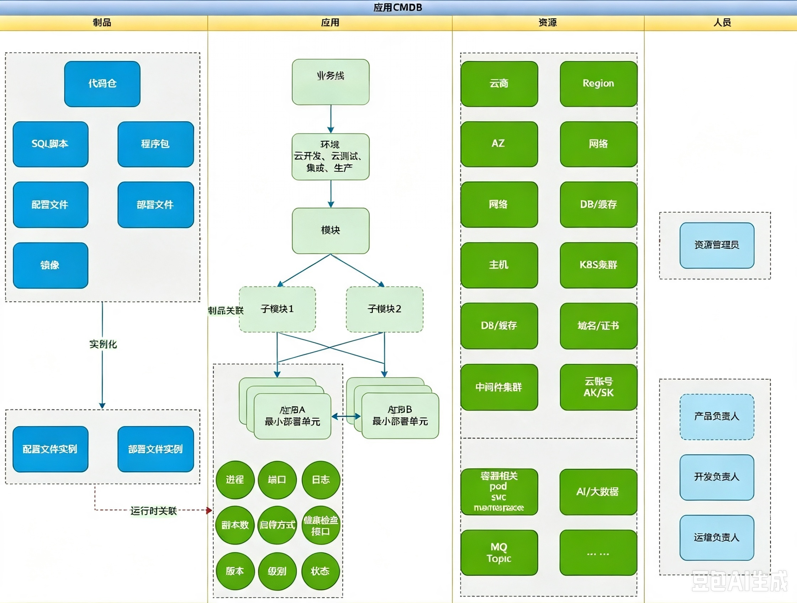
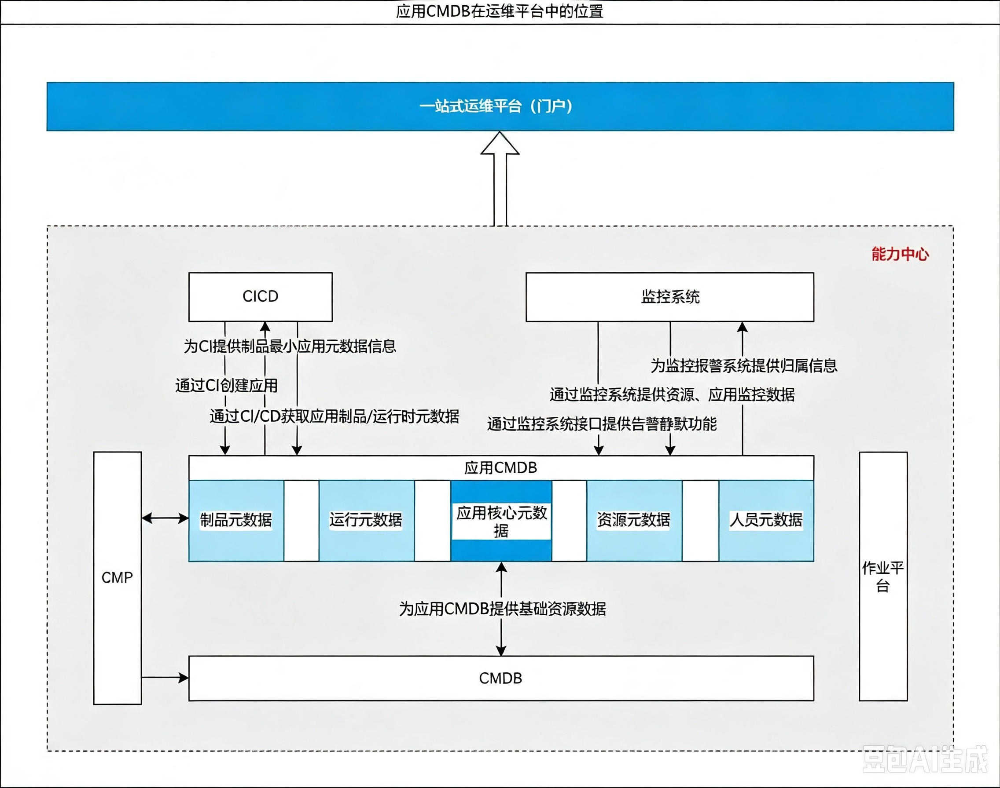

# 应用CMDB建设 副本
> 💡 以应用为中心

# 背景

IT基础设施云化后，运维的重心和价值渐渐聚焦于应用，同时运维的发展必然走向数据化、智能化，如容量管理、根因定位、故障预测等，这些运维场景更多的也都指向了应用。因此建设以应用为中心的应用CMDB，以满足各种运维、运营场景的需求。

## 关键关联元数据

**应用CMDB中需要关联的关键数据**

## 统一运维平台应用CMDB的位置

## 关键设计要素

- 以应用为中心（以应用作为基本单元）

- 环境管理

- 提供统一应用元数据管理模型

- 应用生命周期管理

- 为应用资源、环境、动作（当前CICD已具备能力）、状态统一管理

- 为持续集成、持续发布（当前CICD已具备能力、持续运维、资源管理、监控报警提供支撑

### 以应用为中心

> CMDB需要以应用作为基本单元，使用服务树拓扑管理应用，服务树是对应用系统所提供的业务功能进行领域的划分。

#### 服务拓扑树

服务拓扑树一般不要超过4层：

业务线：可对外提供完整业务服务的一组资源组合（如：支付、货币等）

模块：一组功能的组合（如：商品页后台）

子模块：子功能模块组合

应用：最小部署单元（如：商品页 -> 商品页后台 -> product-logic）

> 子模块非必要

| 业务线 | 模块 | 子模块 | 应用 |
| --- | --- | --- | --- |
| 商品页 | 商品页后台 |  | product-logic |
| 支付页 | 支付页后台 |  | payment-logic |
|  |  |  |  |

### 最小元数据集

1. 应用唯一APPID

2. 应用服务树

3. 应用等级

4. 应用关联人员

### 唯一应用ID

> 应用通过唯一可读id来标记，所有运维系统通过appid进行关联打通。

#### 命名规则

1. 由字母、中横线(-)、数字、点(.) 组成

2. appid 不区分环境，在所有环境中统一

3. 将服务拓扑树由根节点到叶子节点通过点号(.)连接

4. appid 统一以 xx. (公司名缩写)开头

5. 存在中文的情况下，可以使用拼音或英文代替并与中文做映射实现可读

例：xx.业务线.模块.子模块(如果有).应用名称(部署单元名称与CI一致)

> 💡 
> xx.zf.ht.payment-login （xx.支付线.后台.payment-logic服务）

### 提供统一应用元数据管理模型

> 同时支持传统应用架构、微服务、容器应用架构。

1. 应用元数据模型

2. 资源元数据模型

3. 制品元数据模型

4. 运行时元数据模型

5. 人员元数据模型

### 应用生命周期管理

> 管理应用创建-上线-持续运营、运维-下线生命周期管理

### 为应用资源、环境、动作（当前CICD已具备能力）、状态统一管理

#### **基础资源**

1. 明确应用使用的基础资源清单

2. 基础资源使用率

3. 基础资源成本分摊

#### **多环境管理**

对部署到不同环境的中的应用信息统一管理

#### 动作（运行时管理）

1. 提供进程管理功能

2. 提供HPA配置功能

3. 提供副本数管理功能（传统应用、容器应用）

#### 状态

1. 应用状态变更功能（在线、下线、变更、熔断、限流）

2. 与报警系统联动实现自动告警静默

### 为CICD（当前CICD已具备能力）、持续运维、资源管理、监控报警提供支撑

#### CICD

1. 为CI提供制品

2. 为CD提供部署方式、资源

#### 持续运维

1. 提供应用资源、应用层面监控看板（可做连接到监控系统）

2. 提供应用负载水位

3. 提供当前资源用量风险（CPU、内存、磁盘、带宽、证书）

4. 提供关联下游服务、DB、中间件拓扑功能

#### 监控报警

1. 为监控系统提供应用归属元数据