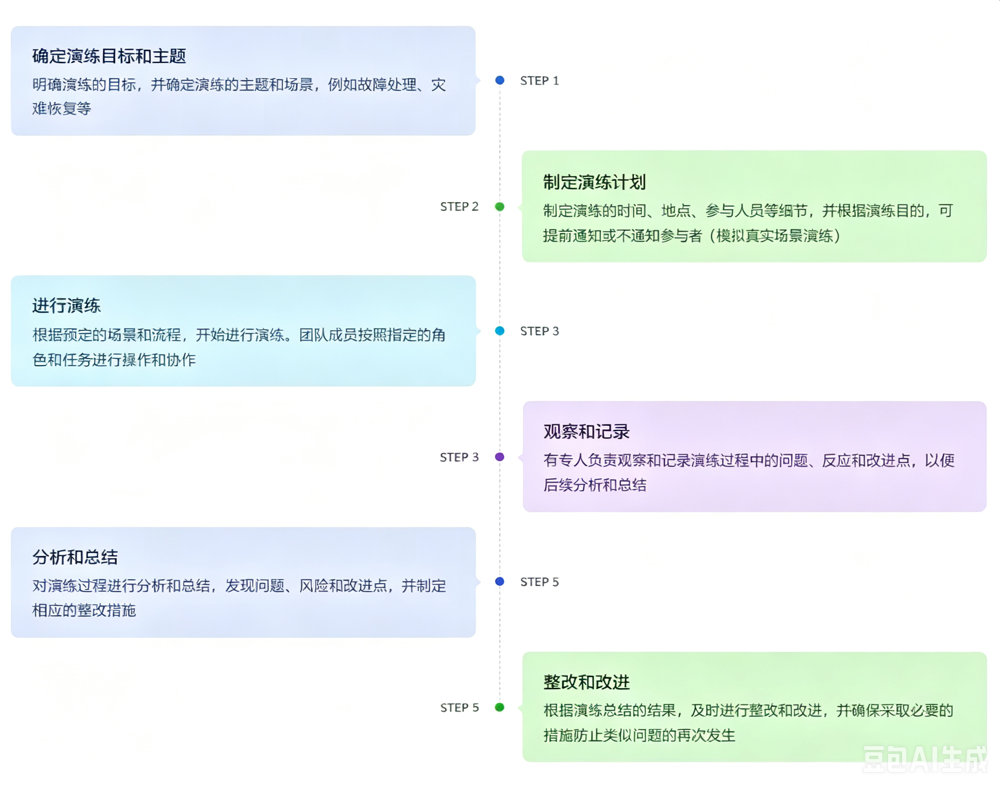

# 不定期演练机制
## 演练目的

**演练的主要目的是为了提高团队的应急响应和故障处理能力，发现和解决潜在风险。具体目标包括：**

> 💡 
> **熟悉故障处理流程**
> 
> 通过演练，团队成员可以熟悉和掌握故障处理的流程、步骤和最佳实践

> 💡 
> **发现潜在风险**
> 
> 通过模拟不同故障场景，发现系统中存在的潜在风险和漏洞，以便及时采取措施进行整改

> 💡 
> **验证整改有效性**
> 
> 对已知风险进行演练，可以验证之前的整改措施是否有效，并及时调整和改进

> 💡 
> **探索未知风险**
> 
> 演练过程中可能会发现一些未知的风险和问题，通过演练及时发现并解决这些潜在风险

## 演练流程

## 演练类型

> 💡 
> **已知风险演练** 
> 这种演练是针对已知的风险和问题进行的，旨在验证之前采取的整改措施的有效性。通过模拟相应的故障场景，团队可以测试之前的修复和改进措施是否能够有效地解决问题，并及时调整和改进

> 💡 
> **未知风险演练** 
> 未知风险演练是一种更为探索性的演练方式，通过模拟未知的故障场景和风险情况，挑战团队的应对能力和创新思维。这种演练可以帮助团队发现未知的风险和问题，并针对性地制定相应的应对措施

## 演练形式

通过制定多套演练试题，定期随机挑选应用进行演练，应用负责人亦可主动参与演练

> 💡 
> **演练试题库**
> 
> 示例：高可用演练试题
> 
> 演练目的：通过一系列方法，检验应用的高可用性
> 
> 演练方法：
> 
> 1. 负载测试：模拟QPS上升，耗时增加等
> 
> 2. 异常注入：服务器故障、网络中断、数据库错误等

> 💡 
> **主动演练**
> 
> 各应用负责人可通过演练平台，选择演练试题，启动演练

> 💡 
> **被动演练**
> 
> 指定应用演练：1次 / 月
> 
> 随机应用演练：1次 / 季度

> 💡 
> XX**应用演练报告**
> 
> 输出XX应用演练得分情况，并输出相应整改措施

> 💡 
> XX**应用演练报告**
> 
> 输出XX应用演练得分情况，并输出相应整改措施

> 💡 
> XX**应用演练报告**
> 
> 输出XX应用演练得分情况，并输出相应整改措施

> 💡 
> XX**应用演练报告**
> 
> 输出XX应用演练得分情况，并输出相应整改措施

## 演练等级与审批人

| **等级** | **细则** | **审批人** |
| --- | --- | --- |
| P1 | 核心功能，影响线上用户 | 研发、运维、各x级及以上负责人参与评审和审批 |
| P2 | 非核心功能，影响线上用户 | 研发、运维、各x级及以上负责人参与评审和审批 |
| P3 | 核心功能，不影响线上用户 | 研发、运维、各x级及以上负责人参与评审和审批 |
| P4 | 非核心功能，不影响线上用户 | 研发、运维、各x级及以上负责人参与评审和审批 |

## 演练报告模版

[演练报告模板](演练报告模板.md)

## 演练计划

| 演练内容 | 演练业务线 | 演练项（分层） | 演练类型 | 演练计划 |
| --- | --- | --- | --- | --- |
| 充值/消费快速止损 | xx线 | 业务 | 恢复 | 每季度分别1次 |
| 业务韧性（熔断/降级） | xx线 | 业务 | 韧性 |  |
| 业务韧性（熔断/降级） | xx线 | 业务 | 韧性 |  |
|  |  |  |  |  |
