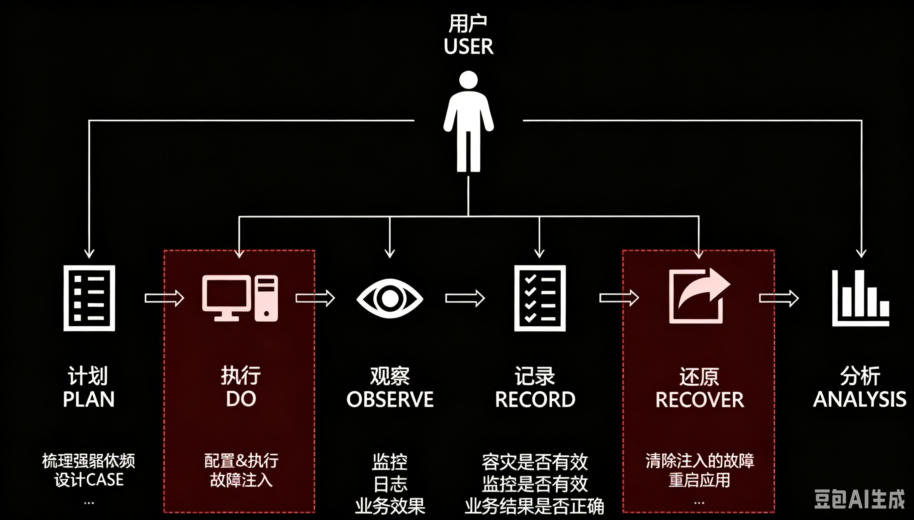

# 故障演练标准初稿v1.1
## 背景

为保障线上平台稳定性运维会在各维度提供不同的手段与措施。

如何校验这些措施在故障发生时是否真的有效？

恢复故障的工具是否实现了容灾？

处理问题的人是否熟练？

沟通机制是否疏漏？

容灾措施的影响是否会辐射到上一层？

这些问题，平时没有太多的机会验证，就是真的有问题，往往也是在真实故障中暴露。所以故障演练是高可用架构中必不可少的一个环节。

## 定义

故障演练就是以可控成本在线上故障重放，通过持续性的演练和回归方式来暴露问题，沉淀通用的故障场景，提升问题的响应和修复能力，缩短故障修复时长（MTTR）。

## 标准

- 执行周期

每个季度1-3次，场景必须覆盖上季度中对用户造成影响最大的故障，环境限定生产环境。（故障已整改完毕且有复现能力）

- 发起人

业务运维

- 演练方案

由发起人编写，通过业务相关研发三级leader与技术委员会（至少1人）评审。内容大致如下：

### **演练前各项检查**

#### **检查必备基础能力**

- 需要应用具备在业务链路中完整传递标记流量的能力

- 需要应用具备模拟下游依赖服务故障的能力

- 需要应用具备请求流量隔离的能力

- 具备应用可观测能力（各项监控指标告警完善）

#### **确定故障演练范围、环境**

##### **要对哪些请求流量注入故障？**

- 选择核心业务链路的请求流量

- 链路分析，标记出核心业务链路

##### **要模拟哪些客户端服务的故障？**

- 此客户端服务发生故障的机率大

- 此客户端服务发生故障时影响的业务范围广

- 此客户端服务发生故障的会影响核心业务

- 此客户端服务发生故障时能制定出可行的应对方案

- 依赖链路分析，确定业务链路中依赖了哪些下游服务

- 反向依赖分析，确定下游服务故障会影响哪些业务链路，评估影响的业务范围

##### **在哪个应用环境模拟故障？**

- 所选环境越接近线上生产环境越好

- 在线上无真实流量的机器做故障演练（关闭外部真实流量）

#### **制定故障应对预案**

针对每种要演练的故障情况，制定故障应对预案

- 预案制定原则：

- 预案得有针对的故障或风险类型，可以是一个或多个

- 得确定预案在什么情况下才能启动/解除，有什么前置要求条件

- 预案得确实有效，即：启动预案后，确实能减小所针对故障的影响范围

- 确定预案开启后会造成的额外影响，不能引发新的故障

#### **配置故障手段**

- 支持快速回退

- 确保流量隔离

- 确认影响范围（如无法确认影响范围则该演练只能在测试环境执行）

#### **确定演练目标**

确定所制定故障应对预案确实生效，即：启动预案后，确实能减小所针对故障的影响范围。

确定故障发生时期业务流程按预期运转（通过业务指标、埋点监控、相关的业务链路追踪工具确定）。

确定应用机器的负载指标在预期范围内（通过各种基础工具的告警确定）（根据自身业务特点设置更多的检查点）

#### **通知涉及的外部人员**

根据评估出的影响范围通知相关业务研发、运营、产品、运维。通知内容要素：

- 故障演练的发起应用

- 故障演练起止时间

- 故障演练应用集群环境

- 对每个相关应用的影响预估。比如：对下游依赖服务的调用峰值 QPS、上游服务收到的异常请求比率

推荐做法：将所有相关人员拉入一个工作群，群名「XXX应用故障演练」，在群里发送故障演练通知、组织协同。并以聊天记录作为操作步骤与观察结果的结论。

### **故障演练中**

1）完成流量隔离操作，并进行观察校验。

2）开启应用的故障模拟开关，观察故障影响。

注意：为确保不影响真实流量，隔离流量发生故障。

3）启动应用的故障应对预案：

- 观察故障影响有无按预期消除或减小影响范围

- 观察各项业务指标

- 观察机器负载指标

- 验证告警通知，以及值守机制信息流转是否正常（补充值班运维验证机制）

- 验证业务流程按预期运转（比如：XX模块正常、YY接口正常）

### **故障演练后**

#### **现场清理**

- 流量关闭、流量隔离任务关闭

- 故障模拟开关关闭、预案关闭

- 清理演练期间写入的数据、缓存、日志等（可选）

- 演练期间操作改动的业务配置开关复位

- 重启应用（可选）

- 通知相关人员演练结束

#### **演练报告与总结**

- 是否达到预期目标

- 预案有无生效

- 业务流程是否按预期运转

- 机器负载是否正常

- 是否有预期之外的现象发生

- 关键指标（业务指标、机器负载指标）收集整理

- 整理后续改进点

- 故障演练流程图

